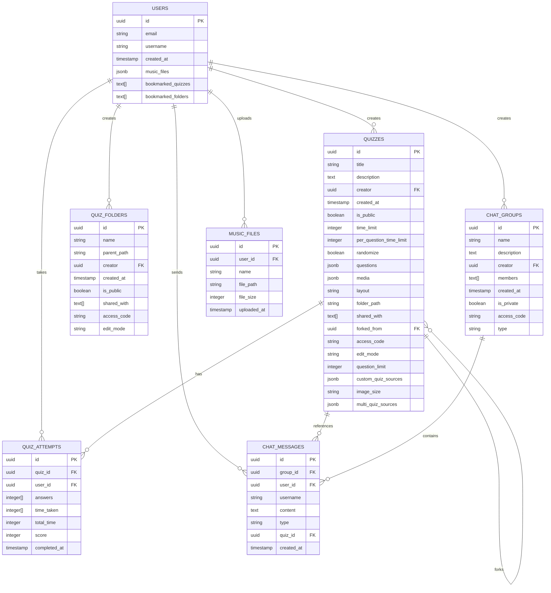

# Database Schema Documentation

## Overview
The Quiz Application uses PostgreSQL via Supabase as the primary database. This document describes the database schema, relationships, and design decisions.

## Entity Relationship Diagram



## Table Definitions

### USERS
Primary user accounts table with authentication and profile data.

```sql
CREATE TABLE users (
    id UUID PRIMARY KEY DEFAULT gen_random_uuid(),
    email TEXT UNIQUE NOT NULL,
    username TEXT UNIQUE NOT NULL,
    created_at TIMESTAMP WITH TIME ZONE DEFAULT NOW(),
    music_files JSONB DEFAULT '[]'::jsonb,
    bookmarked_quizzes TEXT[] DEFAULT ARRAY[]::TEXT[],
    bookmarked_folders TEXT[] DEFAULT ARRAY[]::TEXT[]
);
```

**Indexes:**
- `CREATE INDEX idx_users_email ON users(email);`
- `CREATE INDEX idx_users_username ON users(username);`

### QUIZZES
Core quiz data with questions, media, and configuration.

```sql
CREATE TABLE quizzes (
    id UUID PRIMARY KEY DEFAULT gen_random_uuid(),
    title TEXT NOT NULL,
    description TEXT,
    creator UUID NOT NULL REFERENCES users(id) ON DELETE CASCADE,
    created_at TIMESTAMP WITH TIME ZONE DEFAULT NOW(),
    is_public BOOLEAN DEFAULT true,
    time_limit INTEGER,
    per_question_time_limit INTEGER,
    randomize BOOLEAN DEFAULT false,
    questions JSONB NOT NULL DEFAULT '[]'::jsonb,
    media JSONB DEFAULT '[]'::jsonb,
    layout TEXT DEFAULT 'default',
    folder_path TEXT,
    shared_with TEXT[] DEFAULT ARRAY[]::TEXT[],
    forked_from UUID REFERENCES quizzes(id) ON DELETE SET NULL,
    access_code TEXT UNIQUE,
    edit_mode TEXT DEFAULT 'no_edits',
    question_limit INTEGER,
    custom_quiz_sources JSONB DEFAULT '[]'::jsonb,
    image_size TEXT DEFAULT 'medium',
    multi_quiz_sources JSONB
);
```

**Indexes:**
- `CREATE INDEX idx_quizzes_creator ON quizzes(creator);`
- `CREATE INDEX idx_quizzes_is_public ON quizzes(is_public);`
- `CREATE INDEX idx_quizzes_folder_path ON quizzes(folder_path);`
- `CREATE INDEX idx_quizzes_access_code ON quizzes(access_code);`
- `CREATE INDEX idx_quizzes_created_at ON quizzes(created_at);`

### QUIZ_FOLDERS
Hierarchical folder structure for quiz organization.

```sql
CREATE TABLE quiz_folders (
    id UUID PRIMARY KEY DEFAULT gen_random_uuid(),
    name TEXT NOT NULL,
    parent_path TEXT,
    creator UUID NOT NULL REFERENCES users(id) ON DELETE CASCADE,
    created_at TIMESTAMP WITH TIME ZONE DEFAULT NOW(),
    is_public BOOLEAN DEFAULT true,
    shared_with TEXT[] DEFAULT ARRAY[]::TEXT[],
    access_code TEXT UNIQUE,
    edit_mode TEXT DEFAULT 'no_edits'
);
```

**Indexes:**
- `CREATE INDEX idx_quiz_folders_creator ON quiz_folders(creator);`
- `CREATE INDEX idx_quiz_folders_parent_path ON quiz_folders(parent_path);`
- `CREATE INDEX idx_quiz_folders_is_public ON quiz_folders(is_public);`

## Row Level Security (RLS) Policies

### Quiz Access Policies

```sql
-- Users can view public quizzes or quizzes they created or are shared with
CREATE POLICY "quiz_select_policy" ON quizzes FOR SELECT USING (
    is_public = true 
    OR creator = auth.uid()
    OR auth.uid()::text = ANY(shared_with)
);

-- Users can insert their own quizzes
CREATE POLICY "quiz_insert_policy" ON quizzes FOR INSERT WITH CHECK (
    creator = auth.uid()
);

-- Users can update their own quizzes
CREATE POLICY "quiz_update_policy" ON quizzes FOR UPDATE USING (
    creator = auth.uid()
);

-- Users can delete their own quizzes
CREATE POLICY "quiz_delete_policy" ON quizzes FOR DELETE USING (
    creator = auth.uid()
);
```

### Folder Access Policies

```sql
-- Similar RLS policies for folders
CREATE POLICY "folder_select_policy" ON quiz_folders FOR SELECT USING (
    is_public = true 
    OR creator = auth.uid()
    OR auth.uid()::text = ANY(shared_with)
);

CREATE POLICY "folder_insert_policy" ON quiz_folders FOR INSERT WITH CHECK (
    creator = auth.uid()
);

CREATE POLICY "folder_update_policy" ON quiz_folders FOR UPDATE USING (
    creator = auth.uid()
);

CREATE POLICY "folder_delete_policy" ON quiz_folders FOR DELETE USING (
    creator = auth.uid()
);
```

## JSON Schema Definitions

### Questions JSONB Structure
```json
{
  "type": "array",
  "items": {
    "type": "object",
    "properties": {
      "q": {"type": "string", "description": "Question text"},
      "o": {"type": "array", "items": {"type": "string"}, "description": "Options"},
      "a": {"type": "number", "description": "Correct answer index"},
      "l": {"type": "boolean", "description": "Has LaTeX"}
    },
    "required": ["q", "o", "a"]
  }
}
```

### Media JSONB Structure
```json
{
  "type": "array",
  "items": {
    "type": "object",
    "properties": {
      "type": {"enum": ["img", "audio"]},
      "data": {"type": "string", "description": "Base64 data"},
      "name": {"type": "string"},
      "size": {"enum": ["small", "medium", "large", "xlarge"]},
      "id": {"type": "string"}
    },
    "required": ["type", "data", "name"]
  }
}
```

## Storage Bucket Configuration

### Quiz Media Storage
```sql
-- Create storage bucket for quiz media
INSERT INTO storage.buckets (id, name, public) 
VALUES ('quiz-media', 'quiz-media', false);

-- RLS policy for quiz media access
CREATE POLICY "quiz_media_access" ON storage.objects FOR SELECT USING (
    bucket_id = 'quiz-media'
    AND (
        -- Public quiz media is accessible to all authenticated users
        EXISTS (
            SELECT 1 FROM quizzes q 
            WHERE q.is_public = true 
            AND name LIKE q.id || '/%'
        )
        -- Or user owns the quiz
        OR EXISTS (
            SELECT 1 FROM quizzes q 
            WHERE q.creator = auth.uid() 
            AND name LIKE q.id || '/%'
        )
        -- Or quiz is shared with user
        OR EXISTS (
            SELECT 1 FROM quizzes q 
            WHERE auth.uid()::text = ANY(q.shared_with) 
            AND name LIKE q.id || '/%'
        )
    )
);
```

## Performance Considerations

### Query Optimization
1. **Indexes**: All foreign keys and frequently queried columns are indexed
2. **JSONB Queries**: Use GIN indexes for JSONB columns when needed
3. **Folder Path Queries**: Use prefix matching for hierarchical folder queries

### Caching Strategy
1. **Application Cache**: Frequently accessed quizzes cached in memory
2. **CDN**: Static media files served via CDN
3. **Database Cache**: PostgreSQL query result caching

## Migration Scripts

### Initial Schema Creation
```sql
-- Enable required extensions
CREATE EXTENSION IF NOT EXISTS "uuid-ossp";

-- Run table creation scripts in order
-- 1. users table
-- 2. quiz_folders table  
-- 3. quizzes table
-- 4. quiz_attempts table
-- 5. chat_groups table
-- 6. chat_messages table
-- 7. music_files table

-- Create indexes
-- Create RLS policies
-- Create storage buckets and policies
```

This database design supports the full feature set of the Quiz Application while maintaining performance, security, and scalability.