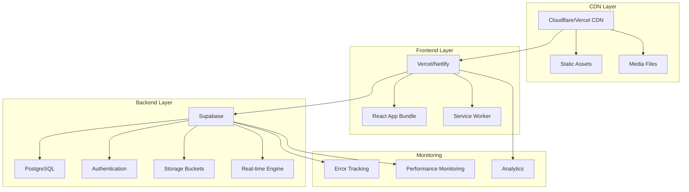

# Quiz Application - Deployment Guide

## Overview
This guide covers deploying the Quiz Application to production environments, including environment setup, build optimization, and monitoring.

## Deployment Architecture



## Environment Configuration

### Environment Variables
```bash
# Frontend (.env)
VITE_SUPABASE_URL=https://your-project.supabase.co
VITE_SUPABASE_ANON_KEY=your-anon-key
VITE_APP_VERSION=1.0.0
VITE_ENABLE_ANALYTICS=true

# Development
VITE_DEV_MODE=true
VITE_ENABLE_DEBUG_CACHE=true

# Production
VITE_PRODUCTION=true
VITE_ENABLE_PWA=true
```

### Supabase Configuration
```sql
-- Database setup
CREATE DATABASE quiz_app_prod;

-- Enable required extensions
CREATE EXTENSION IF NOT EXISTS "uuid-ossp";
CREATE EXTENSION IF NOT EXISTS "pg_trgm";

-- Run migration scripts
\i migrations/001_initial_schema.sql
\i migrations/002_rls_policies.sql
\i migrations/003_storage_setup.sql
```

## Build Optimization

### Vite Configuration
```typescript
// vite.config.ts
export default defineConfig({
  build: {
    rollupOptions: {
      output: {
        manualChunks: {
          'vendor': ['react', 'react-dom'],
          'ui': ['@radix-ui/react-dialog', '@radix-ui/react-select'],
          'utils': ['date-fns', 'lodash-es']
        }
      }
    },
    chunkSizeWarningLimit: 1000,
    sourcemap: true
  },
  define: {
    __APP_VERSION__: JSON.stringify(process.env.npm_package_version)
  }
});
```

### Bundle Analysis
```bash
# Analyze bundle size
npm run build
npx vite-bundle-analyzer dist

# Performance audit
npm install -g lighthouse
lighthouse https://your-app-url.com --output html
```

## Deployment Platforms

### Vercel Deployment
```json
// vercel.json
{
  "framework": "vite",
  "buildCommand": "npm run build",
  "outputDirectory": "dist",
  "rewrites": [
    {
      "source": "/(.*)",
      "destination": "/index.html"
    }
  ],
  "headers": [
    {
      "source": "/assets/(.*)",
      "headers": [
        {
          "key": "Cache-Control",
          "value": "public, max-age=31536000, immutable"
        }
      ]
    }
  ]
}
```

### Netlify Deployment
```toml
# netlify.toml
[build]
  command = "npm run build"
  publish = "dist"

[[redirects]]
  from = "/*"
  to = "/index.html"
  status = 200

[build.environment]
  NODE_VERSION = "18"
```

### Docker Deployment
```dockerfile
# Dockerfile
FROM node:18-alpine AS builder

WORKDIR /app
COPY package*.json ./
RUN npm ci

COPY . .
RUN npm run build

FROM nginx:alpine
COPY --from=builder /app/dist /usr/share/nginx/html
COPY nginx.conf /etc/nginx/nginx.conf
EXPOSE 80
CMD ["nginx", "-g", "daemon off;"]
```

## Performance Optimization

### Code Splitting Implementation
```typescript
// Route-based code splitting
const QuizCreator = lazy(() => 
  import('./pages/QuizCreator').then(module => ({
    default: module.QuizCreator
  }))
);

// Component-based splitting
const HeavyComponent = lazy(() => import('./HeavyComponent'));

// Preload critical routes
const router = createBrowserRouter([
  {
    path: "/dashboard",
    element: <Dashboard />,
    loader: () => import('./pages/QuizCreator') // Preload next likely page
  }
]);
```

### Asset Optimization
```typescript
// Image optimization
const optimizeImage = (file: File): Promise<Blob> => {
  return new Promise((resolve) => {
    const canvas = document.createElement('canvas');
    const ctx = canvas.getContext('2d')!;
    const img = new Image();
    
    img.onload = () => {
      const maxSize = 1920;
      const ratio = Math.min(maxSize / img.width, maxSize / img.height);
      
      canvas.width = img.width * ratio;
      canvas.height = img.height * ratio;
      
      ctx.drawImage(img, 0, 0, canvas.width, canvas.height);
      canvas.toBlob(resolve!, 'image/jpeg', 0.8);
    };
    
    img.src = URL.createObjectURL(file);
  });
};
```

## Security Configuration

### Content Security Policy
```html
<!-- In index.html -->
<meta http-equiv="Content-Security-Policy" content="
  default-src 'self';
  script-src 'self' 'unsafe-inline' https://unpkg.com;
  style-src 'self' 'unsafe-inline';
  img-src 'self' data: blob: https://*.supabase.co;
  connect-src 'self' https://*.supabase.co wss://*.supabase.co;
  font-src 'self';
">
```

### Environment Security
```typescript
// Environment validation
const requiredEnvVars = [
  'VITE_SUPABASE_URL',
  'VITE_SUPABASE_ANON_KEY'
];

requiredEnvVars.forEach(envVar => {
  if (!import.meta.env[envVar]) {
    throw new Error(`Missing required environment variable: ${envVar}`);
  }
});
```

## Monitoring & Analytics

### Error Tracking Setup
```typescript
// Error boundary with reporting
class ErrorBoundary extends Component<Props, State> {
  componentDidCatch(error: Error, errorInfo: React.ErrorInfo) {
    // Send to error tracking service
    if (import.meta.env.PROD) {
      fetch('/api/errors', {
        method: 'POST',
        headers: { 'Content-Type': 'application/json' },
        body: JSON.stringify({
          error: error.message,
          stack: error.stack,
          componentStack: errorInfo.componentStack,
          timestamp: new Date().toISOString()
        })
      });
    }
  }
}
```

### Performance Monitoring
```typescript
// Performance metrics collection
const collectMetrics = () => {
  const navigation = performance.getEntriesByType('navigation')[0] as PerformanceNavigationTiming;
  const paint = performance.getEntriesByType('paint');
  
  const metrics = {
    domContentLoaded: navigation.domContentLoadedEventEnd - navigation.domContentLoadedEventStart,
    firstPaint: paint.find(p => p.name === 'first-paint')?.startTime,
    firstContentfulPaint: paint.find(p => p.name === 'first-contentful-paint')?.startTime,
    pageLoadTime: navigation.loadEventEnd - navigation.loadEventStart
  };
  
  // Send to analytics service
  if (import.meta.env.VITE_ENABLE_ANALYTICS) {
    fetch('/api/metrics', {
      method: 'POST',
      headers: { 'Content-Type': 'application/json' },
      body: JSON.stringify(metrics)
    });
  }
};
```

## Backup & Recovery

### Database Backup
```bash
# Supabase backup
supabase db dump --file backup-$(date +%Y%m%d).sql

# Automated backup script
#!/bin/bash
DATE=$(date +%Y%m%d_%H%M%S)
BACKUP_FILE="quiz_app_backup_$DATE.sql"

# Create backup
supabase db dump --file "$BACKUP_FILE"

# Upload to cloud storage
aws s3 cp "$BACKUP_FILE" s3://your-backup-bucket/database/

# Keep only last 30 days of backups
find . -name "quiz_app_backup_*.sql" -mtime +30 -delete
```

### Application Recovery
```yaml
# kubernetes deployment with health checks
apiVersion: apps/v1
kind: Deployment
metadata:
  name: quiz-app
spec:
  replicas: 3
  template:
    spec:
      containers:
      - name: quiz-app
        image: quiz-app:latest
        ports:
        - containerPort: 80
        livenessProbe:
          httpGet:
            path: /health
            port: 80
          initialDelaySeconds: 30
          periodSeconds: 10
        readinessProbe:
          httpGet:
            path: /ready
            port: 80
          initialDelaySeconds: 5
          periodSeconds: 5
```

## CI/CD Pipeline

### GitHub Actions Example
```yaml
name: Deploy to Production

on:
  push:
    branches: [ main ]

jobs:
  test:
    runs-on: ubuntu-latest
    steps:
    - uses: actions/checkout@v3
    - uses: actions/setup-node@v3
      with:
        node-version: 18
        cache: 'npm'
    
    - run: npm ci
    - run: npm run type-check
    - run: npm run lint
    - run: npm run test
    
  build-and-deploy:
    needs: test
    runs-on: ubuntu-latest
    steps:
    - uses: actions/checkout@v3
    - uses: actions/setup-node@v3
      with:
        node-version: 18
        cache: 'npm'
    
    - run: npm ci
    - run: npm run build
      env:
        VITE_SUPABASE_URL: ${{ secrets.SUPABASE_URL }}
        VITE_SUPABASE_ANON_KEY: ${{ secrets.SUPABASE_ANON_KEY }}
    
    - name: Deploy to Vercel
      uses: amondnet/vercel-action@v25
      with:
        vercel-token: ${{ secrets.VERCEL_TOKEN }}
        vercel-org-id: ${{ secrets.VERCEL_ORG_ID }}
        vercel-project-id: ${{ secrets.VERCEL_PROJECT_ID }}
        vercel-args: '--prod'
```

This deployment guide ensures a robust, scalable, and maintainable production deployment of the Quiz Application.