# Quiz Application - Comprehensive Developer Documentation

## Table of Contents
1. [System Overview](#system-overview)
2. [Architecture & Design](#architecture--design)
3. [Technology Stack](#technology-stack)
4. [Project Structure](#project-structure)
5. [Core Systems](#core-systems)
6. [UI/UX Design](#uiux-design)
7. [Data Flow](#data-flow)
8. [API Integration](#api-integration)
9. [Performance Optimization](#performance-optimization)
10. [Development Guidelines](#development-guidelines)

## System Overview

The Quiz Application is a modern, full-stack React-based platform for creating, managing, and taking interactive quizzes. Built with TypeScript and modern web technologies, it provides a comprehensive ecosystem for educational and entertainment purposes.

### Key Features
- **Quiz Management**: Create, edit, organize quizzes in folder hierarchies
- **Interactive Taking**: Real-time quiz taking with timer support and multimedia
- **Social Features**: Sharing, leaderboards, chat system, collaborative editing
- **AI Integration**: AI-powered quiz generation and assistance
- **Media Support**: Images, audio, LaTeX mathematical expressions
- **Theming**: Customizable themes with advanced styling options
- **Performance**: Caching, lazy loading, and optimized data fetching

## Architecture & Design

### System Architecture

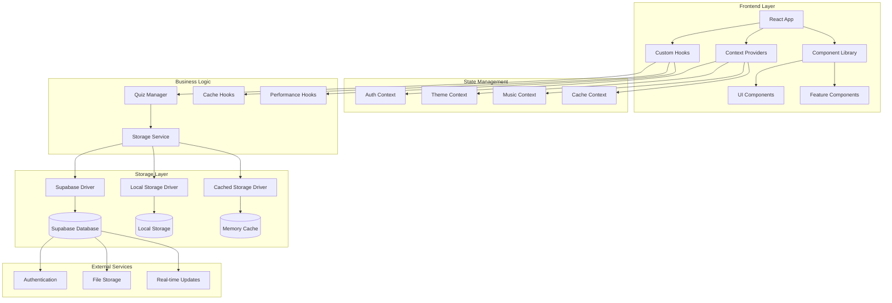

### Component Architecture

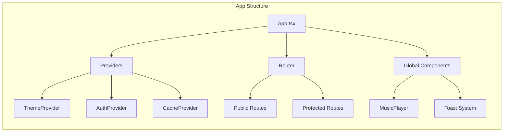

## Technology Stack

### Core Technologies
- **React 18**: UI framework with concurrent features
- **TypeScript**: Type-safe development
- **Vite**: Build tool and development server
- **Tailwind CSS**: Utility-first styling
- **React Router**: Client-side routing

### Backend & Storage
- **Supabase**: Backend-as-a-Service
  - PostgreSQL database
  - Authentication
  - Real-time subscriptions
  - File storage

### State Management
- **React Context**: Global state management
- **Custom Hooks**: Encapsulated business logic
- **Local Storage**: Client-side persistence

### UI Libraries
- **Radix UI**: Accessible component primitives
- **Lucide React**: Icon library
- **Sonner**: Toast notifications

### Performance
- **React.lazy()**: Code splitting
- **Suspense**: Loading states
- **Custom caching**: Performance optimization

## Project Structure

```
src/
├── components/           # Reusable UI components
│   ├── ui/              # Base UI components (Radix + custom)
│   ├── quiz-creator/    # Quiz creation specific components
│   └── unified/         # Unified quiz management components
├── contexts/            # React context providers
├── hooks/               # Custom React hooks
├── lib/                 # Utility libraries and services
│   ├── cache/          # Caching system
│   ├── performance/    # Performance optimization
│   └── storage/        # Data storage abstraction
├── pages/               # Page components (routed)
├── types/               # TypeScript type definitions
└── utils/               # Utility functions
```

### Key Directories Explained

#### `/components`
- **`/ui`**: Reusable, accessible UI primitives built on Radix UI
- **`/quiz-creator`**: Specialized components for quiz creation workflow
- **`/unified`**: Components for the unified quiz management system

#### `/contexts`
- Global state management using React Context API
- Theme, authentication, music, and cache management

#### `/hooks`
- Custom React hooks for business logic encapsulation
- Performance optimization hooks
- Data fetching and caching hooks

#### `/lib`
- **`/storage`**: Storage driver abstraction (Supabase, Local, Cached)
- **`/cache`**: Intelligent caching system for performance
- **`/performance`**: Request batching and optimization utilities

## Core Systems

### 1. Authentication System

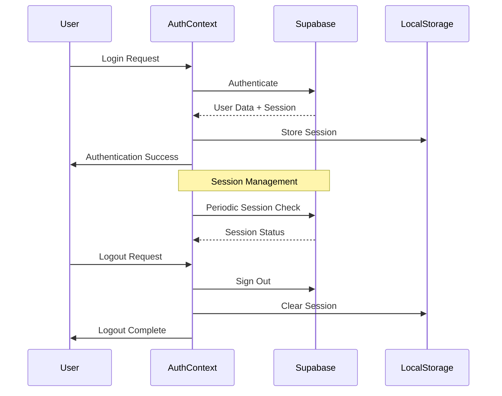

#### Key Components:
- **AuthContext.tsx**: Manages authentication state
- **Auth.tsx**: Login/register interface
- **ProtectedRoute**: Route protection wrapper

#### Features:
- Persistent sessions using localStorage
- Automatic session refresh
- Route-based access control

### 2. Quiz Management System

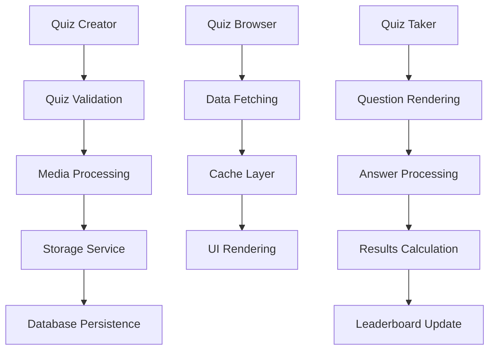

#### Core Features:
- **CRUD Operations**: Create, read, update, delete quizzes
- **Folder Organization**: Hierarchical folder structure
- **Multi-Quiz Composition**: Combine multiple quizzes
- **Media Support**: Images, audio, LaTeX rendering
- **Access Control**: Public/private with sharing capabilities

### 3. Caching System

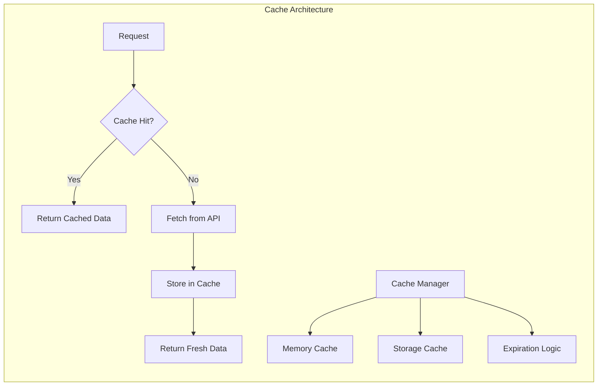

#### Components:
- **CacheManager.ts**: Central cache orchestration
- **CachedStorageDriver.ts**: Storage layer with caching
- **CacheContext.tsx**: React context for cache state

#### Features:
- Multi-level caching (memory + storage)
- Intelligent cache invalidation
- Performance monitoring
- Configurable cache strategies

### 4. Theme System

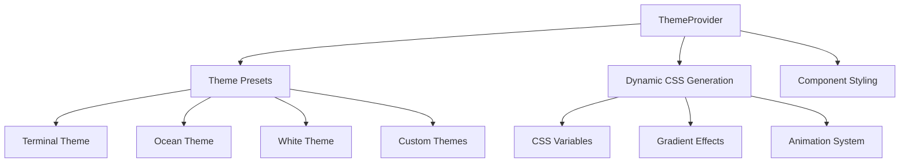

#### Features:
- **Multiple Presets**: Pre-built theme options
- **Dynamic CSS**: Runtime CSS generation
- **Gradient Support**: Advanced visual effects
- **Responsive Design**: Mobile-first approach

## UI/UX Design

### Design Principles

1. **Accessibility First**: WCAG 2.1 AA compliance
2. **Performance Focused**: Optimized for speed and responsiveness
3. **Mobile Responsive**: Progressive enhancement approach
4. **Consistent Patterns**: Reusable design system

### Component Design System

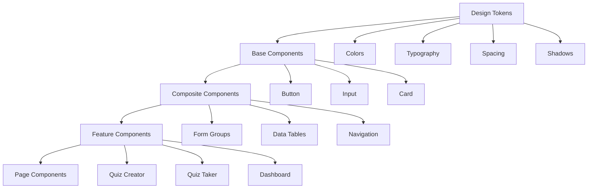

### Theme Architecture

#### Color System
```typescript
interface ThemeColors {
  background: string;    // Primary background
  foreground: string;    // Primary text
  accent: string;        // Accent color
  bright: string;        // Highlighted elements
  dim: string;           // Muted elements
}
```

#### Theme Presets
- **Terminal**: Green-on-black retro computing aesthetic
- **Ocean**: Blue gradient maritime theme
- **Forest**: Green natural tones
- **White**: Clean white with purple accents
- **Minimal**: High contrast, simplified design

## Data Flow

### Quiz Creation Flow

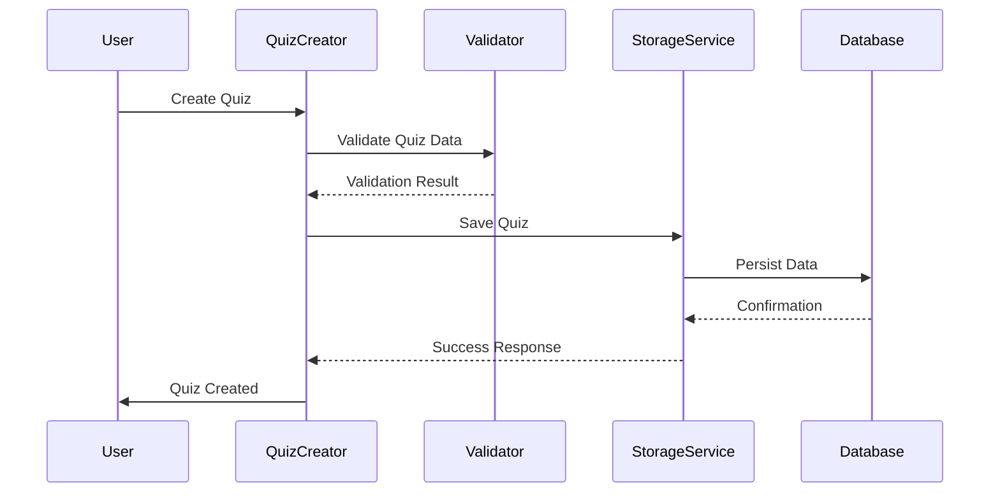

### Quiz Taking Flow

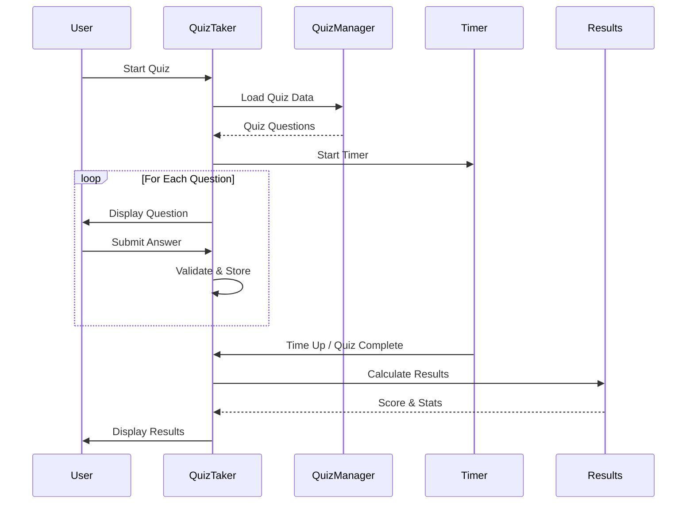

### Real-time Data Synchronization

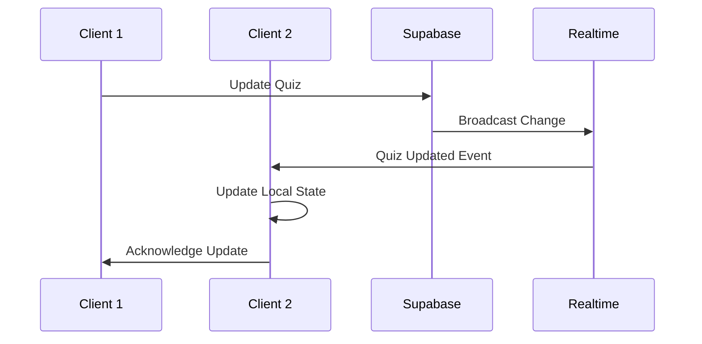

## Performance Optimization

### Code Splitting Strategy

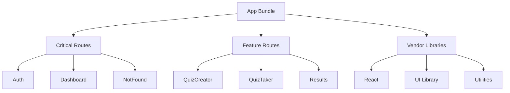

### Caching Strategies

1. **Memory Caching**: Frequently accessed data
2. **Browser Storage**: Persistent user preferences
3. **HTTP Caching**: API response caching
4. **Component Memoization**: Expensive computation results

### Performance Monitoring

```typescript
// Performance metrics tracking
interface PerformanceMetrics {
  componentRenderTime: number;
  apiResponseTime: number;
  cacheHitRate: number;
  bundleSize: number;
}
```

## Development Guidelines

### Code Style
- **TypeScript**: Strict mode enabled
- **ESLint**: Airbnb configuration with custom rules
- **Prettier**: Automatic code formatting
- **Conventional Commits**: Standardized commit messages

### Component Patterns

#### 1. Compound Components
```typescript
// Example: Card with sub-components
<Card>
  <Card.Header>
    <Card.Title>Quiz Statistics</Card.Title>
  </Card.Header>
  <Card.Content>
    <QuizStats data={stats} />
  </Card.Content>
</Card>
```

#### 2. Render Props
```typescript
// Example: Data fetching component
<DataFetcher url="/api/quizzes">
  {({ data, loading, error }) => (
    loading ? <Spinner /> : <QuizList quizzes={data} />
  )}
</DataFetcher>
```

#### 3. Custom Hooks
```typescript
// Example: Quiz management hook
const useQuizManager = (quizId: string) => {
  const [quiz, setQuiz] = useState<Quiz | null>(null);
  const [loading, setLoading] = useState(true);
  
  // Hook implementation...
  
  return { quiz, loading, updateQuiz, deleteQuiz };
};
```

### Testing Strategy

```mermaid
pyramid
    title Testing Pyramid
    section Unit Tests
        Components : 70
        Hooks : 20
        Utils : 10
    section Integration Tests
        User Flows : 60
        API Integration : 40
    section E2E Tests
        Critical Paths : 80
        Edge Cases : 20
```

### Error Handling

```typescript
// Global error boundary pattern
interface ErrorInfo {
  componentStack: string;
  errorBoundary: string;
}

class ErrorBoundary extends Component<Props, State> {
  static getDerivedStateFromError(error: Error): State {
    return { hasError: true, error };
  }
  
  componentDidCatch(error: Error, errorInfo: ErrorInfo) {
    console.error('Error boundary caught an error:', error, errorInfo);
    // Send to error reporting service
  }
}
```

## Getting Started

### Prerequisites
- Node.js 18+ 
- npm or yarn
- Git

### Installation
```bash
# Clone repository
git clone [repository-url]
cd quiz-application

# Install dependencies
npm install

# Environment setup
cp .env.example .env.local
# Configure environment variables

# Start development server
npm run dev
```

### Available Scripts
- `npm run dev`: Start development server
- `npm run build`: Build for production
- `npm run preview`: Preview production build
- `npm run lint`: Run ESLint
- `npm run type-check`: TypeScript type checking

---

This documentation provides a comprehensive overview of the Quiz Application's architecture, design patterns, and development practices. For specific implementation details, refer to the inline code comments and component documentation.