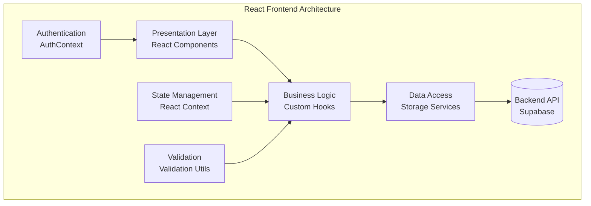
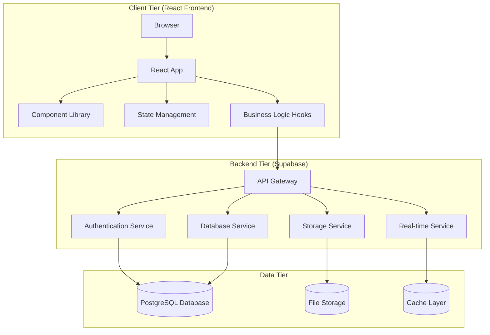
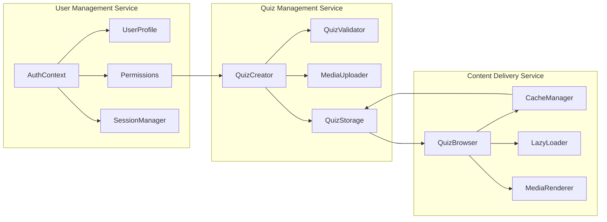

# Quiz Application - Guide for Java Developers

## Table of Contents
1. [Introduction for Java Developers](#introduction-for-java-developers)
2. [Technology Translation](#technology-translation)
3. [Architecture Comparison](#architecture-comparison)
4. [System Design Overview](#system-design-overview)
5. [Data Flow Diagrams](#data-flow-diagrams)
6. [Component Architecture](#component-architecture)
7. [Code Patterns & Examples](#code-patterns--examples)
8. [Database Design](#database-design)

## Introduction for Java Developers

Welcome! If you're coming from a Java background, this guide will help you understand the Quiz Application's frontend architecture by drawing parallels to familiar Java concepts.

### Key Conceptual Mappings

| Java Concept | React/TypeScript Equivalent | Description |
|-------------|---------------------------|-------------|
| **Class** | **Component/Interface** | Reusable code units with defined behavior |
| **Package** | **Module/Directory** | Code organization and namespace management |
| **Interface** | **TypeScript Interface** | Contract definition for data structures |
| **Dependency Injection** | **React Context/Props** | Passing dependencies through the component tree |
| **Observer Pattern** | **React State/useEffect** | Reactive updates when data changes |
| **Factory Pattern** | **Custom Hooks** | Reusable logic creation and configuration |
| **Singleton** | **Context Provider** | Global state management |
| **MVC Architecture** | **React Component Architecture** | Separation of concerns in UI development |

## Technology Translation

### Java Spring Boot ↔ React + TypeScript

```java
// Java Spring Boot Controller
@RestController
@RequestMapping("/api/quizzes")
public class QuizController {
    @Autowired
    private QuizService quizService;
    
    @GetMapping("/{id}")
    public Quiz getQuiz(@PathVariable String id) {
        return quizService.findById(id);
    }
}
```

**React/TypeScript Equivalent:**
```typescript
// React Component with API Integration
const QuizViewer: React.FC<{ quizId: string }> = ({ quizId }) => {
  const [quiz, setQuiz] = useState<Quiz | null>(null);
  
  useEffect(() => {
    const fetchQuiz = async () => {
      const response = await fetch(`/api/quizzes/${quizId}`);
      const quizData = await response.json();
      setQuiz(quizData);
    };
    
    fetchQuiz();
  }, [quizId]);
  
  return quiz ? <QuizDisplay quiz={quiz} /> : <Loading />;
};
```

### Java Service Layer ↔ Custom Hooks

```java
// Java Service Class
@Service
public class QuizService {
    @Autowired
    private QuizRepository repository;
    
    public Quiz createQuiz(Quiz quiz) {
        validateQuiz(quiz);
        return repository.save(quiz);
    }
    
    public List<Quiz> getUserQuizzes(String userId) {
        return repository.findByCreator(userId);
    }
}
```

**React Hook Equivalent:**
```typescript
// Custom React Hook (Service Layer)
export const useQuizService = () => {
  const { user } = useAuth();
  
  const createQuiz = async (quiz: Quiz): Promise<Quiz> => {
    validateQuiz(quiz);
    return await storage.createQuiz(quiz);
  };
  
  const getUserQuizzes = async (): Promise<Quiz[]> => {
    return await storage.getQuizzesByCreator(user.id);
  };
  
  return { createQuiz, getUserQuizzes };
};
```

## Architecture Comparison

### Java Enterprise Architecture

```mermaid
graph TB
    subgraph "Java Spring Boot Architecture"
        A[Web Layer<br/>@RestController] --> B[Service Layer<br/>@Service]
        B --> C[Repository Layer<br/>@Repository]
        C --> D[(Database<br/>JPA/Hibernate)]
        
        E[Security Layer<br/>Spring Security] --> A
        F[Configuration<br/>@Configuration] --> B
        G[Validation<br/>@Valid] --> B
    end
```

### React Frontend Architecture



## System Design Overview

### Overall System Architecture



### Microservices-Style Component Organization

