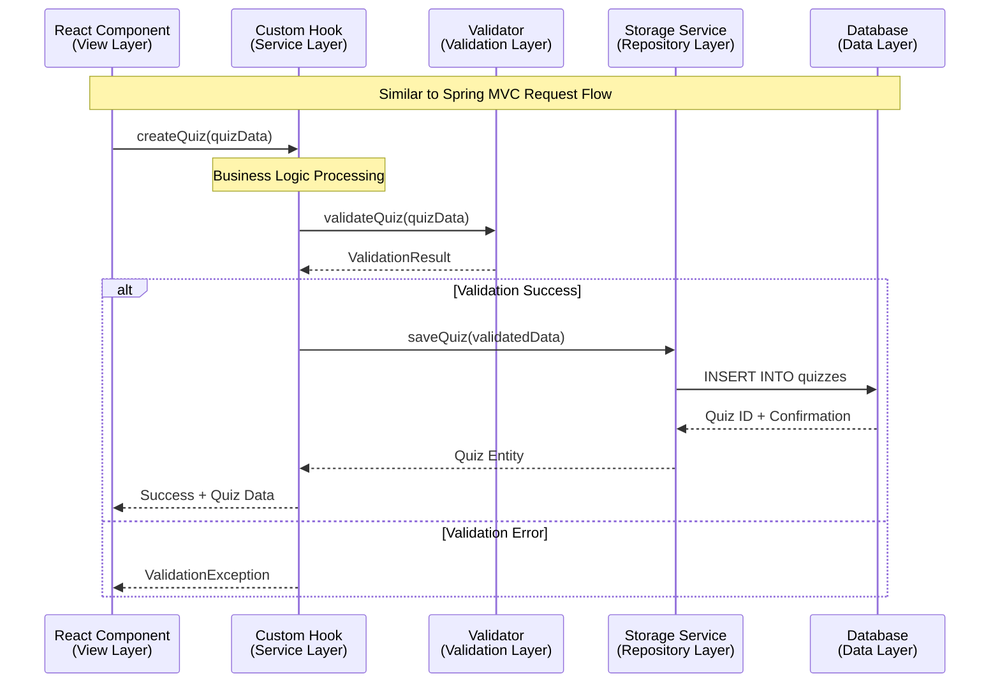
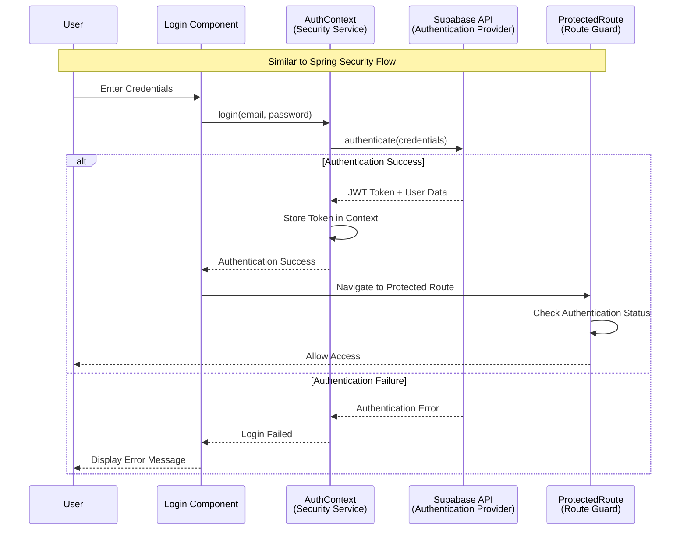
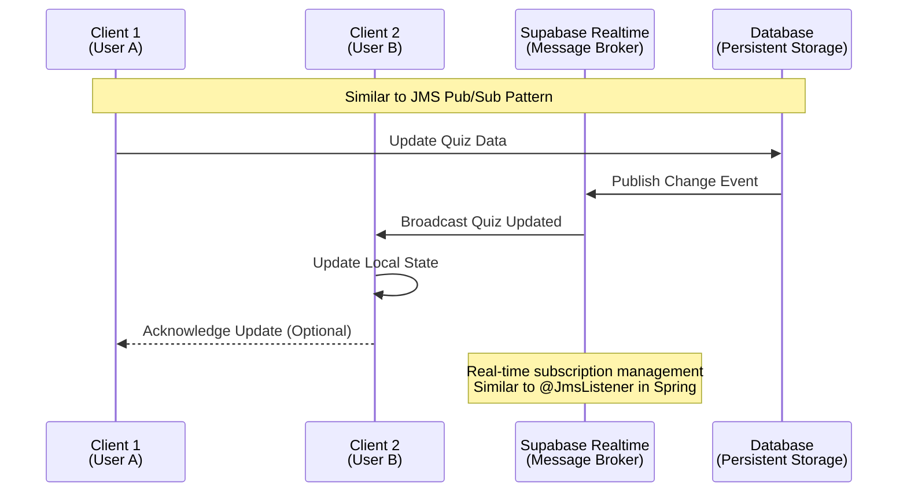

# Java Developer Guide - Part 2: Data Flow & Patterns

## Data Flow Diagrams

### Quiz Creation Workflow (Similar to Spring MVC Flow)



### Authentication Flow (Like Spring Security)



### Real-time Data Synchronization (Like JMS/Message Queues)



## Component Architecture Patterns

### Dependency Injection Pattern (Java Spring ↔ React Context)

**Java Spring Example:**
```java
@Component
public class QuizService {
    @Autowired
    private QuizRepository repository;
    
    @Autowired
    private ValidationService validator;
    
    public Quiz createQuiz(Quiz quiz) {
        validator.validate(quiz);
        return repository.save(quiz);
    }
}
```

**React Context Equivalent:**
```typescript
// Context Provider (like @Configuration class)
export const QuizServiceProvider: React.FC = ({ children }) => {
  const repository = useStorageService();
  const validator = useValidationService();
  
  const createQuiz = async (quiz: Quiz) => {
    await validator.validate(quiz);
    return await repository.save(quiz);
  };
  
  return (
    <QuizServiceContext.Provider value={{ createQuiz }}>
      {children}
    </QuizServiceContext.Provider>
  );
};

// Component using dependency injection
export const QuizCreator: React.FC = () => {
  const { createQuiz } = useContext(QuizServiceContext); // Like @Autowired
  
  const handleSubmit = async (quizData: Quiz) => {
    try {
      const savedQuiz = await createQuiz(quizData);
      // Handle success
    } catch (error) {
      // Handle error
    }
  };
  
  return <QuizForm onSubmit={handleSubmit} />;
};
```

### Repository Pattern Implementation

**Java JPA Repository:**
```java
@Repository
public interface QuizRepository extends JpaRepository<Quiz, String> {
    List<Quiz> findByCreatorAndIsPublic(String creator, boolean isPublic);
    
    @Query("SELECT q FROM Quiz q WHERE q.folderPath LIKE :path%")
    List<Quiz> findByFolderPath(@Param("path") String folderPath);
}
```

**TypeScript Storage Service:**
```typescript
// Repository Interface (like JPA Repository)
interface IQuizRepository {
  findByCreatorAndIsPublic(creator: string, isPublic: boolean): Promise<Quiz[]>;
  findByFolderPath(folderPath: string): Promise<Quiz[]>;
  save(quiz: Quiz): Promise<Quiz>;
  deleteById(id: string): Promise<void>;
}

// Implementation (like JPA Implementation)
export class SupabaseQuizRepository implements IQuizRepository {
  private supabase = createClient();
  
  async findByCreatorAndIsPublic(creator: string, isPublic: boolean): Promise<Quiz[]> {
    const { data } = await this.supabase
      .from('quizzes')
      .select('*')
      .eq('creator', creator)
      .eq('is_public', isPublic);
    
    return data || [];
  }
  
  async findByFolderPath(folderPath: string): Promise<Quiz[]> {
    const { data } = await this.supabase
      .from('quizzes')
      .select('*')
      .like('folder_path', `${folderPath}%`);
    
    return data || [];
  }
}
```

### Factory Pattern for Component Creation

**Java Factory:**
```java
@Component
public class QuizFactory {
    public Quiz createQuiz(QuizType type, QuizData data) {
        switch (type) {
            case MULTIPLE_CHOICE:
                return new MultipleChoiceQuiz(data);
            case TRUE_FALSE:
                return new TrueFalseQuiz(data);
            default:
                throw new IllegalArgumentException("Unsupported quiz type");
        }
    }
}
```

**React Custom Hook Factory:**
```typescript
// Hook Factory (like Factory Pattern)
export const useQuizFactory = () => {
  const createQuiz = (type: QuizType, data: QuizData): Quiz => {
    switch (type) {
      case 'MULTIPLE_CHOICE':
        return createMultipleChoiceQuiz(data);
      case 'TRUE_FALSE':
        return createTrueFalseQuiz(data);
      default:
        throw new Error(`Unsupported quiz type: ${type}`);
    }
  };
  
  return { createQuiz };
};

// Component Factory
export const QuizComponentFactory: React.FC<{ quiz: Quiz }> = ({ quiz }) => {
  switch (quiz.type) {
    case 'MULTIPLE_CHOICE':
      return <MultipleChoiceQuiz quiz={quiz} />;
    case 'TRUE_FALSE':
      return <TrueFalseQuiz quiz={quiz} />;
    default:
      return <UnsupportedQuizType />;
  }
};
```